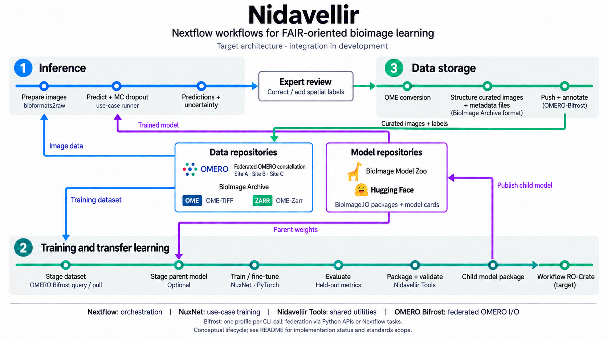

<h1>
  <picture>
    <source media="(prefers-color-scheme: dark)" srcset="docs/images/nf-core-nidavellir_logo_dark.png">
    
  </picture>
</h1>

[](https://github.com/luiskuhn/nidavellir/actions/workflows/nf-test.yml)
[](https://github.com/luiskuhn/nidavellir/actions/workflows/linting.yml)
[](https://www.nf-test.com)

[](https://www.nextflow.io/)
[](https://github.com/nf-core/tools/releases/tag/3.5.2)
[](https://docs.conda.io/en/latest/)
[](https://www.docker.com/)
[](https://sylabs.io/docs/)
[](https://cloud.seqera.io/launch?pipeline=https://github.com/luiskuhn/nidavellir)

## Introduction

**Nidavellir** is the user-facing Nextflow orchestration layer for FAIR-oriented bioimage training, inference, and data storage. This development repository, [luiskuhn/nidavellir](https://github.com/luiskuhn/nidavellir), uses the nf-core template and module conventions; some template identifiers retain the `nf-core/nidavellir` name. The project focuses on microscopy and medical-image segmentation and treats data stewardship, provenance, and iterative model development as connected responsibilities.

## Architecture and related repositories



_Simplified metro-style graphical abstract of the target lifecycle, not a completion or compliance claim.
The companion tools provide reusable building blocks; end-to-end Nextflow wiring
and uncertainty-guided annotation integration remain in development. See
[integration status](#integration-status) below. [Full-size image](docs/images/nidavellir-graphical-abstract.png)._

Nidavellir separates workflow orchestration, use-case applications, and shared
utilities. Users enter through the Nextflow pipeline; trainers and tools can
also be used independently. This README describes how the layers connect.
Their installation instructions, APIs, and command references live in the
companion repositories.

| Layer                                       | Repository                                                                                                          | Responsibility                                                                                                                                                       |
| ------------------------------------------- | ------------------------------------------------------------------------------------------------------------------- | -------------------------------------------------------------------------------------------------------------------------------------------------------------------- |
| 1. User entry point and orchestration       | [Nidavellir](https://github.com/luiskuhn/nidavellir) — this repository                                              | Route workflows, connect inputs and outputs, schedule containerized processes, configure resources, and collect workflow-level provenance.                           |
| 2. Use-case applications                    | [NuxNet Training](https://github.com/luiskuhn/nuxnet-training/tree/master) — current trainer and proof of principle | Own the PyTorch model, scientific preprocessing, training/fine-tuning, and evaluation. Other trainers and inference runners can follow the same integration pattern. |
| 3. Shared library and CLI applications      | [Nidavellir Tools](https://github.com/luiskuhn/nidavellir-tools)                                                    | Provide reusable dataset-reading and model-package operations, including packaging, staging, loading, validation, and publication.                                   |
| 3. Repository access and transfer companion | [OMERO Bifrost (`forward-cycle`)](https://github.com/luiskuhn/omero-bifrost/tree/forward-cycle)                     | Provide workflow-oriented image/metadata operations across single OMERO servers or federated constellations, designed for Nextflow/nf-core and Nidavellir.           |

Use **Nidavellir Tools** for the project, `nidavellir-tools` for the Python
distribution, and `nidavellir_tools` for imports. **OMERO-Bifrost** (also written
OMERO Bifrost in diagram labels) is the repository-transfer companion. **BioImage.IO**
is the model specification/tooling; **BioImage Model Zoo** is a model-sharing
destination; **BioImage Archive** is the data archive.

### How the layers connect

[`main.nf`](main.nf) routes `--workflow_track` to `training`, `inference`,
`data_storage`, or the conversion-only `generate_ometiff` shortcut. Nextflow
owns **when and where** work runs, not model implementations or dataset-reader
logic.

NuxNet imports Nidavellir Tools as a Python library to read the supported
BioImage Archive-style OME-TIFF dataset layout and prepare model artifacts.
Model design and task-specific training decisions remain in NuxNet. This is the
reference pattern for adding another trainer without coupling the shared tools
to one use case.

Nidavellir Tools also exposes CLI applications. The intended Nextflow integration
is a set of thin modules that invoke those applications for parent-model staging,
packaging, integrity inspection, official BioImage.IO validation, and publication.
These wrappers should define container versions, resources, inputs, outputs, and
version reporting, while delegating package logic to the tools themselves.
Library-only functionality stays inside the trainer or inference runner.

Data conversion and OMERO storage are separate workflow adapters, not additional
responsibilities of the trainer. OMERO Bifrost is the Nidavellir ecosystem's
dedicated repository-access companion, complementary to Nidavellir Tools.
BioImage Archive provides datasets; BioImage.IO
defines model interchange and validation; BioImage Model Zoo and Hugging Face
are model-sharing destinations. Creating a compatible package does not
automatically publish it to either service.

### OMERO Bifrost and federated constellations

[OMERO Bifrost](https://github.com/luiskuhn/omero-bifrost/tree/forward-cycle) is part
of the Nidavellir project and is designed to connect **Nextflow/nf-core workflows,
including Nidavellir, to one or many OMERO servers**. Its query, push, and pull
operations separate workflow logic from endpoint-specific hosts, credentials,
group scopes, and access policies. The intended modules use it to discover and
stage image data for training/inference, and to store curated images, labels,
and metadata after expert review.

A **federated OMERO constellation** is a set of independently configured OMERO
endpoints accessed through this common operational interface—not a single
database or an automatic replication service. On the linked development branch,
each CLI invocation selects one server profile; multi-server execution is
available through Bifrost's Python federation APIs, or can be orchestrated as
profile-specific Nextflow tasks. Preserve server-qualified object identities
(server profile plus local object ID), provenance, and per-site failures across
workflow handoffs. Credentials and authorization remain site-specific and should
be supplied securely at runtime, not embedded in samplesheets or published artifacts.

Bifrost owns remote OMERO interaction and its constrained, standards-aware
metadata handling; Nidavellir Tools owns local dataset reading and reusable
model operations. BioImage Archive remains a separate dataset source, not an
OMERO endpoint managed by Bifrost. This separation allows a trainer to consume
staged files without knowing which institution holds the source images.

**Integration boundary:** Bifrost provides the companion capability; this
pipeline's current upload module still invokes the OMERO CLI directly. The
Bifrost-backed modules and constellation-aware channels shown in the target
architecture are planned integration, not enabled by this documentation update.
See Bifrost's [architecture](https://github.com/luiskuhn/omero-bifrost/blob/forward-cycle/docs/architecture.md),
[Nextflow integration guide](https://github.com/luiskuhn/omero-bifrost/blob/forward-cycle/docs/nextflow-nfcore.md),
and [current command/profile contracts](https://github.com/luiskuhn/omero-bifrost/tree/forward-cycle#readme)
for implementation details; pin and verify the chosen revision when building modules.

### Workflow handoffs and responsibilities

The target training lifecycle is dataset/optional parent-model staging, trainer
execution, model packaging, validation, and reuse or explicitly configured
publication. At each boundary, the pipeline must preserve a clear artifact
contract:

- **Dataset handoff:** workflow samplesheets select inputs; they are not the
  trainer's dataset manifest. Adapters must provide the selected application's
  expected image/annotation layout, calibration, and split metadata. Format
  conversion alone does not create a labelled training dataset.
- **Model handoff:** pass a portable model package and its metadata, not only a
  checkpoint. Parent-weight initialization and full training-state resumption
  are distinct operations that the application must support explicitly.
- **Validation handoff:** retain the official validation report alongside the
  tested package's identity. Integrity inspection, technical compatibility, and
  scientific evaluation are separate checks; none substitutes for the others.
- **Provenance and storage:** retain dataset/parent identifiers, software
  versions, parameters, metrics, and output references across processes.
  Workflow-level RO-Crate packaging complements model-package provenance.

### Integration status

The architecture above is the target integration, not a claim that the
companion applications are already connected end to end.

| Pipeline component                  | Current implementation                                                                                                                                     |
| ----------------------------------- | ---------------------------------------------------------------------------------------------------------------------------------------------------------- |
| Track routing                       | Implemented in `main.nf`.                                                                                                                                  |
| Conversion and storage              | OME-Zarr/OME-TIFF conversion and OMERO upload-manifest wiring exist; live OMERO operations are opt-in (`omero_dry_run` defaults to true).                  |
| Federated OMERO access              | Designed around OMERO Bifrost; profile-aware Bifrost wrappers are not yet wired into these tracks. Current upload uses the OMERO CLI directly.             |
| [Training](workflows/training.nf)   | Six-stage scaffold; it does not yet invoke NuxNet or the shared Nidavellir Tools CLI.                                                                      |
| [Inference](workflows/inference.nf) | Conversion/export scaffold with pass-through model logic; mask/labelled filenames do not yet represent actual segmentation.                                |
| Model lifecycle integration         | Local staging/publication/RO-Crate building blocks exist. Thin Nidavellir Tools wrappers and end-to-end trainer integration remain to be wired and tested. |

### Where to find detailed documentation

- **Pipeline execution, track configuration, and outputs:** this README and the
  local [usage](docs/usage.md), [output](docs/output.md), and
  [architecture](docs/architecture.md) guides.
- **NuxNet training, fine-tuning, model configuration, and container commands:**
  the [NuxNet README](https://github.com/luiskuhn/nuxnet-training/blob/master/README.md).
- **Shared Python APIs, CLI syntax, package formats, and validation requirements:**
  the [Nidavellir Tools README](https://github.com/luiskuhn/nidavellir-tools#readme).
- **OMERO transfers, federation, server profiles, and metadata operations:**
  the [OMERO Bifrost README](https://github.com/luiskuhn/omero-bifrost/tree/forward-cycle#readme).

Keep application-specific instructions in those companion repositories.
This repository documents their workflow integration and artifact handoffs.

### Standards-aware data and model reuse

Nidavellir Tools provides the data-loading building block for workflows aligned
with **REMBI** (Recommended Metadata for Biological Images) and **MIFA** (Metadata,
Incentives, Formats and Accessibility). REMBI describes the experimental and
imaging context needed for reuse; MIFA extends the focus to reusable annotations
and AI datasets. These guidelines inform dataset curation, rather than defining
a single file format ([Sarkans et al., 2021](https://doi.org/10.1038/s41592-021-01166-8);
[Zulueta-Coarasa et al., 2025](https://doi.org/10.1038/s41592-025-02835-8)).

The current loader implements the supported BioImage Archive-style image/label
table layout and reads OME-TIFF pixels, axes, and physical voxel sizes from
OME-XML metadata. This follows the image-to-annotation association used in the
[BioImage Archive file-list specification](https://www.ebi.ac.uk/bioimage-archive/help-file-list/).
Archive submissions additionally require contextual metadata described in the
[REMBI](https://www.ebi.ac.uk/bioimage-archive/rembi-help-overview/) and
[MIFA](https://www.ebi.ac.uk/bioimage-archive/mifa-overview/) guidance.
The loader does **not** validate complete REMBI/MIFA records, implement every
archive layout, or certify submission compliance; curation remains the dataset
provider's responsibility.

The [OME Data Model and OME-XML schema](https://ome-model.readthedocs.io/en/stable/ome-xml/)
define microscopy metadata; [OME-TIFF](https://ome-model.readthedocs.io/en/stable/ome-tiff/specification.html)
embeds OME-XML in TIFF. [OME-Zarr/OME-NGFF](https://ngff.openmicroscopy.org/latest/)
uses chunked arrays and NGFF metadata, not OME-XML embedded in TIFF
([Moore et al., 2021](https://doi.org/10.1038/s41592-021-01326-w)).
The pipeline supplies conversion between OME-Zarr and OME-TIFF where configured;
the current Nidavellir Tools training reader accepts **OME-TIFF, not OME-Zarr**.
Reading selected OME fields is not full XML-schema validation.

Model reuse has a separate contract: the
[BioImage.IO specification](https://github.com/bioimage-io/spec-bioimage-io)
describes the model and its referenced artifacts for BioImage Model Zoo-compatible
consumers. Nidavellir Tools packages and validates that model contract and can
publish the package with a [Hugging Face model card](https://huggingface.co/docs/hub/model-cards).
Hugging Face is a hosting and metadata layer, not a replacement for BioImage.IO's
tensor/weight specification. Neither standard defines this trainer's dataset
folder layout, and a package must still satisfy its destination's submission
requirements.

### Uncertainty-guided spatial supervision

Nidavellir Tools includes **Monte Carlo dropout** prediction primitives for
PyTorch convolutional networks, including segmentation U-Nets designed and
trained with supported dropout layers. Repeated stochastic forward passes
provide prediction means and dispersion estimates while other layers remain in
evaluation mode. This is an approximate model-uncertainty approach, not a
guarantee of calibrated confidence or a complete account of data uncertainty
([Gal and Ghahramani, 2016](https://proceedings.mlr.press/v48/gal16.html)).

In the proposed human-in-the-loop cycle, spatial uncertainty maps can help
prioritize regions for expert inspection, correction, or additional segmentation
labels. Those reviewed labels become versioned training data for the next
fine-tuning round. This applies the broader rationale of uncertainty-guided
iterative experimentation described by
[Hie, Bryson and Berger, 2020](https://doi.org/10.1016/j.cels.2020.09.007);
that study is not itself a validation of this segmentation workflow or MC dropout.
Region selection, annotation interfaces, and feedback ingestion still need
application/workflow integration. Uncertainty does not generate ground truth:
experts supply labels, and selection should also account for diversity, bias,
annotation cost, and held-out evaluation.

### A reusable transfer-learning blueprint

Together, NuxNet and Nidavellir Tools demonstrate an application-level blueprint:
**train → package and validate → optionally publish → reuse as a parent → fine-tune
and produce a child package**. The BioImage.IO package carries weights, model
description, architecture/dependencies, and test artifacts; Hugging Face can host
that package and its model card. A subsequent compatible NuxNet run uses the
parent weights as initialization and records lineage in its new artifacts.
This makes the model package the handoff between runs, rather than a private
checkpoint path.

The blueprint supports successive adaptation to new annotated data; it does not
imply arbitrary model interoperability, automatic optimizer-state resumption,
or guaranteed improvement. Preprocessing, tensor semantics, architecture, and
label definitions must remain compatible or be adapted explicitly. Nextflow's
role is to make these handoffs reproducible and schedulable; the detailed
training and package commands remain in the companion READMEs linked above.

## Lifecycle goals and FAIR context

Nidavellir is designed for **iterative human-in-the-loop (HITL) model development** instead of isolated one-off runs. Its target lifecycle spans dataset staging, model pre-training or fine-tuning, inference, expert correction/curation, and reintegration of corrected annotations into subsequent training rounds. This lifecycle perspective aligns with established interactive-segmentation practice (for example [Mesmer](https://www.nature.com/articles/s41587-021-01094-0) and [Cellpose](https://www.nature.com/articles/s41592-022-01663-4)) while preserving nf-core standards for portability, provenance, and repeatability.

From a stewardship and software perspective, Nidavellir follows FAIR principles ([Wilkinson _et al._ 2016](https://www.nature.com/articles/sdata201618)) together with FAIR4RS recommendations ([Barker _et al._ 2022](https://doi.org/10.1038/s41597-022-01710-x)). Concretely, this includes interoperable community formats and metadata standards such as OME-NGFF / OME-Zarr ([Moore _et al._ 2021](https://doi.org/10.1038/s41592-021-01326-w)) plus machine-readable provenance artifacts (for example RO-Crate, [Soiland-Reyes _et al._ 2022](https://doi.org/10.48550/arXiv.2201.07917)).

For bioimage machine learning, these practices are foundational for **AI-readiness**: robust model development depends on discoverable, consistently structured, and provenance-rich datasets that can be reused across pre-training, fine-tuning, benchmarking, and external validation. Recent high-impact biomedical AI work reinforces this point by highlighting that generalist/foundation medical AI requires large, curated, interoperable data ecosystems with explicit governance ([Moor _et al._ 2023](https://doi.org/10.1038/s41586-023-05881-4)).

Nidavellir is also designed to operate with **OMERO servers** as institutional and collaborative repositories, including staging datasets from OMERO, tracking OMERO object identifiers during processing, and writing curated outputs (images, labels, annotations, and derived artifacts) back for iterative improvement and governance. This use of OMERO/IDR-compatible practices aligns with both established scalable bioimage data-management literature and the federated system-architecture direction promoted by European bioimage infrastructures (Euro-BioImaging / ELIXIR), where interoperable services are coordinated across acquisition, analysis, and archive layers ([Allan _et al._ 2012](https://www.nature.com/articles/nmeth.1896), [Williams _et al._ 2017](https://doi.org/10.1038/nmeth.4326), [Burel _et al._ 2015](https://doi.org/10.3389/fninf.2015.00047), [Euro-BioImaging Bio-Hub](https://www.eurobioimaging.eu/), [ELIXIR Imaging Community](https://elixir-europe.org/communities/imaging)).

### Scientific and FAIR-oriented infrastructure for scalable bioimage analysis

Nidavellir is intentionally positioned at the intersection of reproducible workflows, data interoperability, and computational pathology / bioimage AI lifecycle management:

- **Scalable parallel execution:** Nextflow enables process-level parallelization and robust scheduling across HPC, cloud, and containerized environments, supporting high-throughput conversion, training, and inference workloads.
- **Data structures designed for scale:** OME-Zarr / NGFF storage supports chunked, multiscale data access patterns that are well suited for distributed and parallel bioimage processing pipelines.
- **FAIR-oriented output design:** standardized formats, explicit metadata capture, software version pinning, and RO-Crate-oriented packaging facilitate downstream reuse and auditability.
- **Model lifecycle traceability:** staged inputs, parent-model provenance, and evaluation/publication scaffolds support auditable progression from pre-training through deployment-ready checkpoints.
- **HITL scientific practice:** expert feedback is treated as first-class training signal, supporting iterative evaluation and refinement under domain shift and label scarcity; improvement must be measured.

In practical terms, this architecture is suitable for teams implementing foundation-model adaptation pipelines for bioimaging, where self-supervised pre-training can be combined with supervised fine-tuning and iterative expert curation to improve generalization and robustness in real laboratory settings.

### Current implemented capabilities (MVP)

This repository currently provides concrete data-staging/storage and inference scaffolds, plus a structured training-track stage graph with deterministic scaffold outputs for downstream integration.

The conversion/storage tracks implement:

1. Read an image samplesheet and stage local input files.
2. Convert source images to **OME-Zarr** using `bioformats2raw`.
3. Write machine-readable training-input metadata (`fair_training_inputs.ndjson`).
4. Track software versions for reproducibility.

In addition, the `training` track now executes a six-stage scaffold DAG (dataset staging, parent-model staging, training, evaluation, publication, RO-Crate packaging) that emits stable channel contracts. Local modules for BioImage.IO model handling and training RO-Crate generation are included as reusable building blocks for follow-up wiring.

### Target full lifecycle architecture

The graphical abstract numbers workflow tracks, not mandatory execution order
or the three software layers. Each track can be selected independently:

1. **Inference (`inference`):** stage image data and a trained model from their
   respective repositories; prepare images; predict with optional MC dropout;
   hand predictions/uncertainty to expert review. A compatible inference runner
   and its format adapters still need integration.
2. **Training and transfer learning (`training`):** stage the dataset and an
   optional parent model; train/fine-tune; evaluate; build and validate a child
   model package. Publication is a separate, explicitly configured action.
   Workflow RO-Crate packaging collects run provenance; it is not the model format.
3. **Data storage (`data_storage`):** OME conversion → **Structure curated images + metadata files (BioImage Archive format)** → **Push + annotate (OMERO-Bifrost)**.
   The middle step means preparing the supported image/annotation file lists and
   contextual metadata; it is planned, not an implemented general BioImage Archive
   submission exporter. The final step targets selected OMERO servers, not an
   automatic submission to BioImage Archive.

`generate_ometiff` is an additional conversion-only shortcut, not a fourth
learning-cycle track. The existing six-stage training scaffold is an integration
skeleton, not a one-to-one implementation of the target diagram. MC dropout is
optional; expert annotation and feedback ingestion are not automated here.

### Workflow diagrams: current wiring and target lifecycle

The SVG is a developer-facing map of current wiring, with a separate planned
Bifrost federation inset. The graphical abstract above and Mermaid diagram below
describe the target lifecycle. Neither is a claim that all depicted steps run today.

[Download the vector graphic (SVG)](docs/images/nf-core-nidavellir_contained-workflows.svg)

```mermaid
flowchart LR
    DATA["Data repositories: federated OMERO / separate BioImage Archive source"]
    MODELS["Model repositories: BioImage Model Zoo / Hugging Face"]
    subgraph INF["1 Inference - target"]
        I1["Prepare images"] --> I2["Predict + optional MC dropout"]
        I2 --> I3["Predictions + uncertainty"]
    end
    I3 --> REVIEW["Expert review: correct or add spatial labels"]
    subgraph STORE["3 Data storage - target"]
        S1["OME conversion"] --> S2["Structure curated images + metadata files: BioImage Archive format"]
        S2 --> S3["Push + annotate: OMERO-Bifrost"]
    end
    REVIEW --> S1
    S3 -->|curated images and labels to OMERO| DATA
    DATA -->|image data| I1
    MODELS -->|trained model| I2
    subgraph TRAIN["2 Training and transfer learning - target"]
        T1["Stage dataset"] --> T2["Stage optional parent model"]
        T2 --> T3["Train / fine-tune: NuxNet"]
        T3 --> T4["Evaluate"]
        T4 --> T5["Package + validate: Nidavellir Tools"]
        T5 --> T6["Child model package"]
        T6 --> RC["Workflow RO-Crate: run provenance"]
    end
    DATA -->|training dataset| T1
    MODELS -->|parent weights| T2
    T6 -->|explicit publication| MODELS
    BF["OMERO-Bifrost: query / push / pull"]
    BF -.->|Nextflow staging: OMERO sources only| DATA
    BF <-->|profile A| OA["OMERO site A"]
    BF <-->|profile B| OB["OMERO site B"]
    BF <-->|profile C| OC["OMERO site C"]
```


<details>
<summary>Target lifecycle diagram (editable Mermaid)</summary>



</details>

> [!NOTE]
> Some lifecycle components described above are planned and may not yet be implemented in the current release.

## Usage

> [!NOTE]
> If you are new to Nextflow and nf-core, please refer to [this page](https://nf-co.re/docs/usage/installation) on how to set-up Nextflow. Make sure to [test your setup](https://nf-co.re/docs/usage/introduction#how-to-run-a-pipeline) with `-profile test` before running the workflow on actual data.

First, prepare a samplesheet with your input image data:

`samplesheet.csv`:

```csv
sample,image_path,omero_id
cell_001,/data/images/cell_001.ome.tiff,OMERO:Image:123
cell_002,/data/images/cell_002.czi,
```

Required columns:

- `sample`: Unique sample identifier.
- `image_path`: Local path to an input image file supported by Bio-Formats.

Optional columns:

- `omero_id`: Optional provenance string carried into workflow metadata, not an instruction to download an image. For federated use, retain the server identity too; dedicated profile-aware input handling remains planned.

Now, you can run the pipeline using:

```bash
nextflow run luiskuhn/nidavellir -r dev \
   -profile docker \
   --workflow_track generate_ometiff \
   --input samplesheet.csv \
   --outdir ./results
```

> [!WARNING]
> Provide pipeline parameters via the CLI or Nextflow `-params-file`. Use `-c` for infrastructure, process resources, and module arguments. The existing converter preset below includes a legacy parameter fallback; keep dataset/run settings in your params file.

See the [usage guide](docs/usage.md) and [parameter schema](nextflow_schema.json). Examples use the moving `dev` branch; pin a tested commit or tag for reproducible runs. The conversion-only example does not contact OMERO.

### Reusable raw2ometiff configuration (team preset style)

If you want to keep pipeline inputs separate from module-level converter flags, use two files:

1. `params.yaml` for pipeline parameters (`input`, `outdir`, `workflow_track`).
2. `raw2ometiff.config` for `RAW2OMETIFF` module arguments (`ext.args`).

The repository now includes both files as ready-to-edit templates:

- [params.yaml](params.yaml)
- [raw2ometiff.config](raw2ometiff.config)

Copy these files to your launch directory before using the relative paths below.

`raw2ometiff.config` sets a default value and allows clean runtime override:

This existing preset includes a legacy `params.raw2ometiff_args` fallback alongside
its process selector. Use the CLI or a params file for dataset and run parameters;
the preset is not a general recommendation to put pipeline parameters in config files.

```groovy
params.raw2ometiff_args = params.raw2ometiff_args ?: '--compression LZW --max_workers 8'

process {
    withName: 'RAW2OMETIFF' {
        ext.args = { params.raw2ometiff_args }
    }
}
```

Run with defaults from both files:

```bash
nextflow run luiskuhn/nidavellir -r dev \
  -profile docker \
  -params-file params.yaml \
  -c raw2ometiff.config
```

Override raw2ometiff behavior at launch time without editing config files:

```bash
nextflow run luiskuhn/nidavellir -r dev \
  -profile docker \
  -params-file params.yaml \
  -c raw2ometiff.config \
  --raw2ometiff_args '--rgb --compression JPEG --quality 0.85 --max_workers 8'
```

How this works:

- `params.yaml` keeps run inputs and output location reusable and portable.
- `raw2ometiff.config` centralizes module-level CLI tuning via `ext.args`.
- `--raw2ometiff_args` is a single override hook suitable for team presets and automation.

### Workflow track selection

Use `--workflow_track` to select the high-level flow:

- `data_storage`: data storage flow (supports `--data_storage_mode full|generate_ometiff`)
- `generate_ometiff`: conversion-only shortcut (`bioformats2raw -> raw2ometiff`)
- `training`: scaffold DAG track (explicit stages 1-6 with stable output contracts; placeholder logic for training/eval internals)
- `inference`: implemented conversion/export scaffold (`bioformats2raw -> [placeholder inference] -> raw2ometiff` for mask + labelled outputs)

`--pipeline_track` is retained as a backward-compatible alias. If both are set, `--workflow_track` takes precedence.

### Inference pipeline (current implementation details)

The `inference` track currently executes a concrete conversion + export path and a clearly marked model-inference placeholder:

1. **Input staging to OME-Zarr** (`BIOFORMATS2RAW`)
   - Converts each input image into `<sample>.ome.zarr` for analysis-friendly NGFF representation.
2. **Model inference placeholder scaffold**
   - Temporary pass-through that duplicates each staged OME-Zarr into two channels representing:
     - segmentation mask export (`output_suffix: mask`)
     - labelled image export (`output_suffix: labelled`)
   - This is a deliberate scaffold and should be replaced by a real model runner in a follow-up update.
3. **OME-TIFF exports** (`RAW2OMETIFF`)
   - Produces `<sample>_mask.ome.tif` and `<sample>_labelled.ome.tif`.

To run this track:

```bash
nextflow run luiskuhn/nidavellir -r dev \
  --input ./samplesheet.csv \
  --outdir ./results \
  --workflow_track inference \
  -profile docker
```

## Pipeline output

See the [output guide](docs/output.md). Outputs depend on the selected track: conversion/storage produce image files and manifests; training currently emits in-memory placeholder contracts, not trained weights or a completed RO-Crate. Inference exports are pass-through images, not segmentation predictions.

## Credits

Nidavellir was originally written by Luis Kuhn Cuellar, Carolin Schwitalla, Sabrina Krakau.

## Contributions and Support

If you would like to contribute to this pipeline, please see the [contributing guidelines](.github/CONTRIBUTING.md).

For questions or problems, use the [repository issue tracker](https://github.com/luiskuhn/nidavellir/issues).

## Citations

<!-- TODO nf-core: Add citation for pipeline after first release. Uncomment lines below and update Zenodo doi and badge at the top of this file. -->
<!-- If you use nf-core/nidavellir for your analysis, please cite it using the following doi: [10.5281/zenodo.XXXXXX](https://doi.org/10.5281/zenodo.XXXXXX) -->

<!-- TODO nf-core: Add bibliography of tools and data used in your pipeline -->

An extensive list of references for the tools used by the pipeline can be found in the [`CITATIONS.md`](CITATIONS.md) file.

For conceptual and methodological context, the following references are particularly relevant to Nidavellir's design goals:

- Sarkans U, Chiu W, Collinson L, _et al._ REMBI: Recommended Metadata for Biological Images—enabling reuse of microscopy data in biology. _Nat Methods_ 2021. doi: [10.1038/s41592-021-01166-8](https://doi.org/10.1038/s41592-021-01166-8).
- Zulueta-Coarasa T, Jug F, Mathur A, _et al._ MIFA: Metadata, Incentives, Formats and Accessibility guidelines to improve the reuse of AI datasets for bioimage analysis. _Nat Methods_ 2025. doi: [10.1038/s41592-025-02835-8](https://doi.org/10.1038/s41592-025-02835-8).
- Gal Y, Ghahramani Z. Dropout as a Bayesian Approximation: Representing Model Uncertainty in Deep Learning. _ICML, PMLR_ 48, 1050–1059 (2016). [Paper](https://proceedings.mlr.press/v48/gal16.html).
- Hie B, Bryson BD, Berger B. Leveraging Uncertainty in Machine Learning Accelerates Biological Discovery and Design. _Cell Syst_ 11, 461–477.e9 (2020). doi: [10.1016/j.cels.2020.09.007](https://doi.org/10.1016/j.cels.2020.09.007).
- Wilkinson MD, Dumontier M, Aalbersberg IJJ, _et al._ The FAIR Guiding Principles for scientific data management and stewardship. _Sci Data_ 2016. doi: [10.1038/sdata.2016.18](https://doi.org/10.1038/sdata.2016.18).
- Barker M, Chue Hong NP, Katz DS, _et al._ Introducing the FAIR Principles for research software. _Sci Data_ 2022. doi: [10.1038/s41597-022-01710-x](https://doi.org/10.1038/s41597-022-01710-x).
- Moore J, Allan C, Besson S, _et al._ OME-NGFF: a next-generation file format for expanding bioimaging data-access strategies. _Nat Methods_ 2021. doi: [10.1038/s41592-021-01326-w](https://doi.org/10.1038/s41592-021-01326-w).
- Soiland-Reyes S, Sefton P, Crosas M, _et al._ Packaging research artefacts with RO-Crate. 2022. doi: [10.48550/arXiv.2201.07917](https://doi.org/10.48550/arXiv.2201.07917).
- Allan C, Burel J-M, Moore J, _et al._ OMERO: flexible, model-driven data management for experimental biology. _Nat Methods_ 2012. doi: [10.1038/nmeth.1896](https://doi.org/10.1038/nmeth.1896).
- Williams E, Moore J, Li SW, _et al._ Image Data Resource: a bioimage data integration and publication platform. _Nat Methods_ 2017. doi: [10.1038/nmeth.4326](https://doi.org/10.1038/nmeth.4326).
- Burel J-M, Allen C, Williams E, _et al._ Publishing and Sharing Multi-Dimensional Image Data with OMERO. _Front Neuroinform_ 2015. doi: [10.3389/fninf.2015.00047](https://doi.org/10.3389/fninf.2015.00047).
- Moor M, Banerjee O, Abad ZS, _et al._ Foundation models for generalist medical artificial intelligence. _Nature_ 2023. doi: [10.1038/s41586-023-05881-4](https://doi.org/10.1038/s41586-023-05881-4).
- Greenwald NF, Miller G, Moen E, _et al._ Whole-cell segmentation of tissue images with human-level performance using large-scale data annotation and deep learning. _Nat Biotechnol._ 2021 (Mesmer). doi: [10.1038/s41587-021-01094-0](https://doi.org/10.1038/s41587-021-01094-0).
- Pachitariu M, Stringer C. Cellpose 2.0: how to train your own model. _Nat Methods_ 2022. doi: [10.1038/s41592-022-01663-4](https://doi.org/10.1038/s41592-022-01663-4).
- Taleb A, Lippert C, Klein T, Nabi M. Multimodal self-supervised learning for medical image analysis. 2020. arXiv: [2006.06650](https://arxiv.org/abs/2006.06650).
- Azizi S, Mustafa B, Ryan F, _et al._ Big self-supervised models advance medical image classification. _ICCV_ 2021. [OpenAccess link](https://openaccess.thecvf.com/content/ICCV2021/html/Azizi_Big_Self-Supervised_Models_Advance_Medical_Image_Classification_ICCV_2021_paper.html).
- Ronneberger O, Fischer P, Brox T. U-Net: Convolutional Networks for Biomedical Image Segmentation. _MICCAI_ 2015. arXiv: [1505.04597](https://arxiv.org/abs/1505.04597).

You can cite the `nf-core` publication as follows:

> **The nf-core framework for community-curated bioinformatics pipelines.**
>
> Philip Ewels, Alexander Peltzer, Sven Fillinger, Harshil Patel, Johannes Alneberg, Andreas Wilm, Maxime Ulysse Garcia, Paolo Di Tommaso & Sven Nahnsen.
>
> _Nat Biotechnol._ 2020 Feb 13. doi: [10.1038/s41587-020-0439-x](https://dx.doi.org/10.1038/s41587-020-0439-x).
