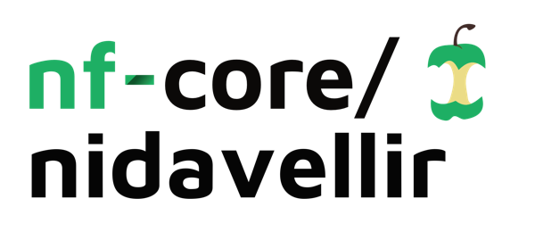
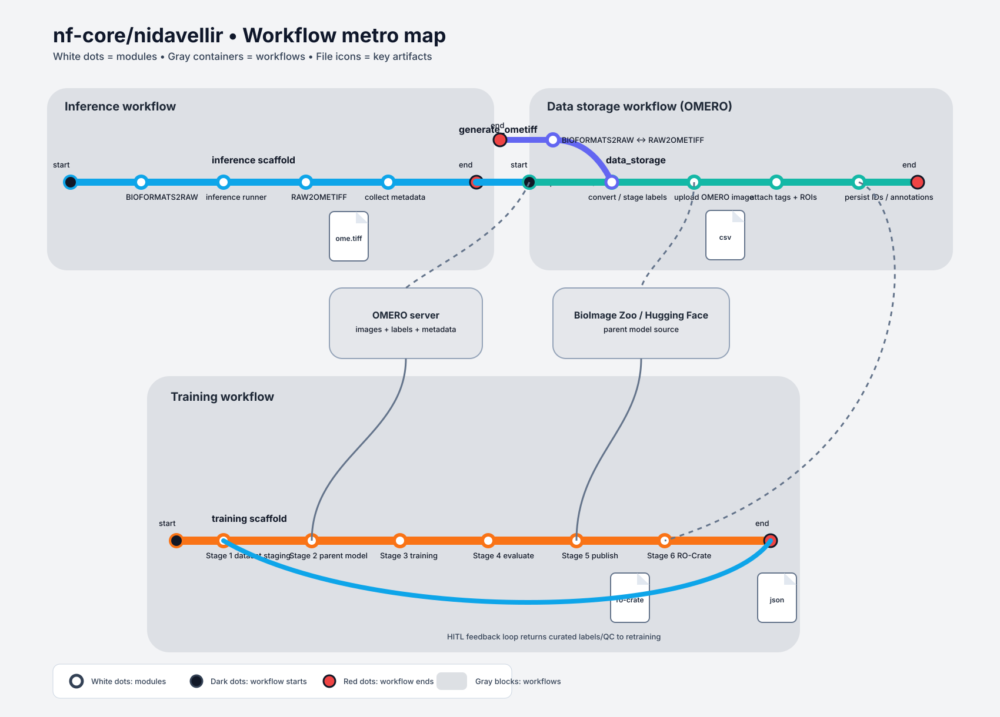
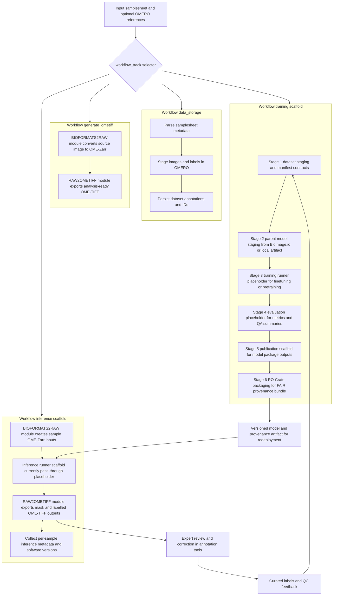

<h1>
  <picture>
    <source media="(prefers-color-scheme: dark)" srcset="docs/images/nf-core-nidavellir_logo_dark.png">
    
  </picture>
</h1>

[](https://github.com/nf-core/nidavellir/actions/workflows/ci.yml)
[](https://github.com/nf-core/nidavellir/actions/workflows/linting.yml)[](https://nf-co.re/nidavellir/results)[](https://doi.org/10.5281/zenodo.XXXXXXX)
[](https://www.nf-test.com)

[](https://www.nextflow.io/)
[](https://github.com/nf-core/tools/releases/tag/3.5.2)
[](https://docs.conda.io/en/latest/)
[](https://www.docker.com/)
[](https://sylabs.io/docs/)
[](https://cloud.seqera.io/launch?pipeline=https://github.com/nf-core/nidavellir)

[](https://nfcore.slack.com/channels/nidavellir)[](https://bsky.app/profile/nf-co.re)[](https://mstdn.science/@nf_core)[](https://www.youtube.com/c/nf-core)

## Introduction

**nf-core/nidavellir** is a Nextflow / nf-core workflow for FAIR, reproducible, and extensible bioimage machine-learning workflows, with a focus on microscopy and medical-image segmentation. The project is motivated by a practical gap in many bioimage AI efforts: strong model architectures are often limited by fragmented data lifecycle practices. Nidavellir therefore treats data stewardship, provenance, and iterative model development as a single engineering problem rather than separate tasks.

Nidavellir is designed for **iterative human-in-the-loop (HITL) model development** instead of isolated one-off runs. Its target lifecycle spans dataset staging, model pre-training or fine-tuning, inference, expert correction/curation, and reintegration of corrected annotations into subsequent training rounds. This lifecycle perspective aligns with established interactive-segmentation practice (for example [Mesmer](https://www.nature.com/articles/s41587-021-01094-0) and [Cellpose](https://www.nature.com/articles/s41592-022-01663-4)) while preserving nf-core standards for portability, provenance, and repeatability.

From a stewardship and software perspective, Nidavellir follows FAIR principles ([Wilkinson *et al.* 2016](https://www.nature.com/articles/sdata201618)) together with FAIR4RS recommendations ([Barker *et al.* 2022](https://doi.org/10.1038/s41597-022-01710-x)). Concretely, this includes interoperable community formats and metadata standards such as OME-NGFF / OME-Zarr ([Moore *et al.* 2021](https://doi.org/10.1038/s41592-021-01326-w)) plus machine-readable provenance artifacts (for example RO-Crate, [Soiland-Reyes *et al.* 2022](https://doi.org/10.48550/arXiv.2201.07917)).

For bioimage machine learning, these practices are foundational for **AI-readiness**: robust model development depends on discoverable, consistently structured, and provenance-rich datasets that can be reused across pre-training, fine-tuning, benchmarking, and external validation. Recent high-impact biomedical AI work reinforces this point by highlighting that generalist/foundation medical AI requires large, curated, interoperable data ecosystems with explicit governance ([Moor *et al.* 2023](https://doi.org/10.1038/s41586-023-05881-4)).

Nidavellir is also designed to operate with **OMERO servers** as institutional and collaborative repositories, including staging datasets from OMERO, tracking OMERO object identifiers during processing, and writing curated outputs (images, labels, annotations, and derived artifacts) back for iterative improvement and governance. This use of OMERO/IDR-compatible practices aligns with both established scalable bioimage data-management literature and the federated system-architecture direction promoted by European bioimage infrastructures (Euro-BioImaging / ELIXIR), where interoperable services are coordinated across acquisition, analysis, and archive layers ([Allan *et al.* 2012](https://www.nature.com/articles/nmeth.1896), [Li *et al.* 2016](https://www.nature.com/articles/nmeth.3789), [Burel *et al.* 2015](https://doi.org/10.3389/fninf.2015.00047), [Euro-BioImaging Bio-Hub](https://www.eurobioimaging.eu/), [ELIXIR Imaging Community](https://elixir-europe.org/communities/imaging)).

### Scientific and FAIR-oriented infrastructure for scalable bioimage analysis

Nidavellir is intentionally positioned at the intersection of reproducible workflows, data interoperability, and computational pathology / bioimage AI lifecycle management:

- **Scalable parallel execution:** Nextflow enables process-level parallelization and robust scheduling across HPC, cloud, and containerized environments, supporting high-throughput conversion, training, and inference workloads.
- **Data structures designed for scale:** OME-Zarr / NGFF storage supports chunked, multiscale data access patterns that are well suited for distributed and parallel bioimage processing pipelines.
- **FAIR-by-construction outputs:** standardized formats, explicit metadata capture, software version pinning, and RO-Crate-oriented packaging facilitate downstream reuse and auditability.
- **Model lifecycle traceability:** staged inputs, parent-model provenance, and evaluation/publication scaffolds support auditable progression from pre-training through deployment-ready checkpoints.
- **HITL scientific practice:** expert feedback is treated as first-class training signal, enabling continuous performance improvement under domain shift and label scarcity.

In practical terms, this architecture is suitable for teams implementing foundation-model adaptation pipelines for bioimaging, where self-supervised pre-training can be combined with supervised fine-tuning and iterative expert curation to improve generalization and robustness in real laboratory settings.

### Current implemented capabilities (MVP)

This repository currently provides concrete data-staging/storage and inference scaffolds, plus a structured training-track stage graph with deterministic scaffold outputs for downstream integration.

Default implemented steps include:

1. Read a bioimage training samplesheet and stage image inputs.
2. Convert source images to **OME-Zarr** using `bioformats2raw`.
3. Write machine-readable training-input metadata (`fair_training_inputs.ndjson`).
4. Track software versions for reproducibility.

In addition, the `training` track now executes a six-stage scaffold DAG (dataset staging, parent-model staging, training, evaluation, publication, RO-Crate packaging) that emits stable channel contracts. Local modules for BioImage.io model handling and training RO-Crate generation are included as reusable building blocks for follow-up wiring.

### Target full lifecycle architecture

Nidavellir is being developed as a modular system that covers the full ML lifecycle for microscopy and medical imaging segmentation.

- **Training pipeline**
  - Stage datasets from OMERO
  - Stage pretrained models (BioImage Model Zoo)
  - Run cross-validation training (for example PyTorch models such as U-Net)
  - Evaluate model performance
  - Publish trained models
  - Package outputs as FAIR RO-Crate artifacts with full provenance
- **Inference pipeline**
  - Convert images to OME-Zarr (NGFF)
  - Run model inference
  - Export segmentation masks and labelled images
- **Data storage pipeline**
  - Store images and labels in OMERO
  - Annotate datasets with metadata

The architecture is explicitly designed for end-to-end human-in-the-loop learning, where model predictions are reviewed and corrected by experts, persisted as curated labels, and cycled back into subsequent retraining iterations.

### Workflow diagram (current tracks and target HITL loop)

[Download the vector graphic (SVG)](docs/images/nf-core-nidavellir_contained-workflows.svg)



<details>
<summary>Mermaid source (editable)</summary>



</details>

> [!NOTE]
> Some lifecycle components described above are planned and may not yet be implemented in the current release.

## Usage

> [!NOTE]
> If you are new to Nextflow and nf-core, please refer to [this page](https://nf-co.re/docs/usage/installation) on how to set-up Nextflow. Make sure to [test your setup](https://nf-co.re/docs/usage/introduction#how-to-run-a-pipeline) with `-profile test` before running the workflow on actual data.

First, prepare a samplesheet with your input image data:

`samplesheet.csv`:

```csv
sample,image_path,omero_id
cell_001,/data/images/cell_001.ome.tiff,OMERO:Image:123
cell_002,/data/images/cell_002.czi,
```

Required columns:
- `sample`: Unique sample identifier.
- `image_path`: Local path to an input image file supported by Bio-Formats.

Optional columns:
- `omero_id`: Upstream OMERO object identifier for provenance tracking.

Now, you can run the pipeline using:

```bash
nextflow run nf-core/nidavellir \
   -profile <docker/singularity/.../institute> \
   --input samplesheet.csv \
   --outdir <OUTDIR>
```

> [!WARNING]
> Please provide pipeline parameters via the CLI or Nextflow `-params-file` option. Custom config files including those provided by the `-c` Nextflow option can be used to provide any configuration _**except for parameters**_; see [docs](https://nf-co.re/docs/usage/getting_started/configuration#custom-configuration-files).

For more details and further functionality, please refer to the [usage documentation](https://nf-co.re/nidavellir/usage) and the [parameter documentation](https://nf-co.re/nidavellir/parameters).

### Reusable raw2ometiff configuration (team preset style)

If you want to keep pipeline inputs separate from module-level converter flags, use two files:

1. `params.yaml` for pipeline parameters (`input`, `outdir`, `workflow_track`).
2. `raw2ometiff.config` for `RAW2OMETIFF` module arguments (`ext.args`).

The repository now includes both files as ready-to-edit templates:

- `params.yaml`
- `raw2ometiff.config`

`raw2ometiff.config` sets a default value and allows clean runtime override:

```groovy
params.raw2ometiff_args = params.raw2ometiff_args ?: '--compression LZW --max_workers 8'

process {
    withName: 'RAW2OMETIFF' {
        ext.args = { params.raw2ometiff_args }
    }
}
```

Run with defaults from both files:

```bash
nextflow run nf-core/nidavellir \
  -profile docker \
  -params-file params.yaml \
  -c raw2ometiff.config
```

Override raw2ometiff behavior at launch time without editing config files:

```bash
nextflow run nf-core/nidavellir \
  -profile docker \
  -params-file params.yaml \
  -c raw2ometiff.config \
  --raw2ometiff_args '--rgb --compression JPEG --quality 0.85 --max_workers 8'
```

How this works:

- `params.yaml` keeps run inputs and output location reusable and portable.
- `raw2ometiff.config` centralizes module-level CLI tuning via `ext.args`.
- `--raw2ometiff_args` is a single override hook suitable for team presets and automation.

### Workflow track selection

Use `--workflow_track` to select the high-level flow:

- `data_storage`: data storage flow (supports `--data_storage_mode full|generate_ometiff`)
- `generate_ometiff`: conversion-only shortcut (`bioformats2raw -> raw2ometiff`)
- `training`: scaffold DAG track (explicit stages 1-6 with stable output contracts; placeholder logic for training/eval internals)
- `inference`: implemented conversion/export scaffold (`bioformats2raw -> [placeholder inference] -> raw2ometiff` for mask + labelled outputs)

`--pipeline_track` is retained as a backward-compatible alias. If both are set, `--workflow_track` takes precedence.

### Inference pipeline (current implementation details)

The `inference` track currently executes a concrete conversion + export path and a clearly marked model-inference placeholder:

1. **Input staging to OME-Zarr** (`BIOFORMATS2RAW`)
   - Converts each input image into `<sample>.ome.zarr` for analysis-friendly NGFF representation.
2. **Model inference placeholder scaffold**
   - Temporary pass-through that duplicates each staged OME-Zarr into two channels representing:
     - segmentation mask export (`output_suffix: mask`)
     - labelled image export (`output_suffix: labelled`)
   - This is a deliberate scaffold and should be replaced by a real model runner in a follow-up update.
3. **OME-TIFF exports** (`RAW2OMETIFF`)
   - Produces `<sample>_mask.ome.tif` and `<sample>_labelled.ome.tif`.

To run this track:

```bash
nextflow run nf-core/nidavellir \
  --input ./samplesheet.csv \
  --outdir ./results \
  --workflow_track inference \
  -profile docker
```


## Pipeline output

To see the results of an example test run with a full size dataset refer to the [results](https://nf-co.re/nidavellir/results) tab on the nf-core website pipeline page.
For more details about the output files and reports, please refer to the
[output documentation](https://nf-co.re/nidavellir/output).

## Credits

nf-core/nidavellir was originally written by Luis Kuhn Cuellar, Carolin Schwitalla, Sabrina Krakau.

We thank the following people for their extensive assistance in the development of this pipeline:

<!-- TODO nf-core: If applicable, make list of people who have also contributed -->

## Contributions and Support

If you would like to contribute to this pipeline, please see the [contributing guidelines](.github/CONTRIBUTING.md).

For further information or help, don't hesitate to get in touch on the [Slack `#nidavellir` channel](https://nfcore.slack.com/channels/nidavellir) (you can join with [this invite](https://nf-co.re/join/slack)).

## Citations

<!-- TODO nf-core: Add citation for pipeline after first release. Uncomment lines below and update Zenodo doi and badge at the top of this file. -->
<!-- If you use nf-core/nidavellir for your analysis, please cite it using the following doi: [10.5281/zenodo.XXXXXX](https://doi.org/10.5281/zenodo.XXXXXX) -->

<!-- TODO nf-core: Add bibliography of tools and data used in your pipeline -->

An extensive list of references for the tools used by the pipeline can be found in the [`CITATIONS.md`](CITATIONS.md) file.

For conceptual and methodological context, the following references are particularly relevant to Nidavellir's design goals:

- Wilkinson MD, Dumontier M, Aalbersberg IJJ, *et al.* The FAIR Guiding Principles for scientific data management and stewardship. _Sci Data_ 2016. doi: [10.1038/sdata.2016.18](https://doi.org/10.1038/sdata.2016.18).
- Barker M, Chue Hong NP, Katz DS, *et al.* Introducing the FAIR Principles for research software. _Sci Data_ 2022. doi: [10.1038/s41597-022-01710-x](https://doi.org/10.1038/s41597-022-01710-x).
- Moore J, Allan C, Besson S, *et al.* OME-NGFF: a next-generation file format for expanding bioimaging data-access strategies. _Nat Methods_ 2021. doi: [10.1038/s41592-021-01326-w](https://doi.org/10.1038/s41592-021-01326-w).
- Soiland-Reyes S, Sefton P, Crosas M, *et al.* Packaging research artefacts with RO-Crate. 2022. doi: [10.48550/arXiv.2201.07917](https://doi.org/10.48550/arXiv.2201.07917).
- Allan C, Burel J-M, Moore J, *et al.* OMERO: flexible, model-driven data management for experimental biology. _Nat Methods_ 2012. doi: [10.1038/nmeth.1896](https://doi.org/10.1038/nmeth.1896).
- Li S, Burel J-M, Cousins S, *et al.* IDR: an open platform for image data integration and publication. _Nat Methods_ 2016. doi: [10.1038/nmeth.3789](https://doi.org/10.1038/nmeth.3789).
- Burel J-M, Allen C, Williams E, *et al.* Publishing and Sharing Multi-Dimensional Image Data with OMERO. _Front Neuroinform_ 2015. doi: [10.3389/fninf.2015.00047](https://doi.org/10.3389/fninf.2015.00047).
- Moor M, Banerjee O, Abad ZS, *et al.* Foundation models for generalist medical artificial intelligence. _Nature_ 2023. doi: [10.1038/s41586-023-05881-4](https://doi.org/10.1038/s41586-023-05881-4).
- Greenwald NF, Miller G, Moen E, *et al.* Whole-cell segmentation of tissue images with human-level performance using large-scale data annotation and deep learning. _Nat Biotechnol._ 2021 (Mesmer). doi: [10.1038/s41587-021-01094-0](https://doi.org/10.1038/s41587-021-01094-0).
- Pachitariu M, Stringer C. Cellpose 2.0: how to train your own model. _Nat Methods_ 2022. doi: [10.1038/s41592-022-01663-4](https://doi.org/10.1038/s41592-022-01663-4).
- Taleb A, Lippert C, Klein T, Nabi M. Multimodal self-supervised learning for medical image analysis. 2020. arXiv: [2006.06650](https://arxiv.org/abs/2006.06650).
- Azizi S, Mustafa B, Ryan F, *et al.* Big self-supervised models advance medical image classification. _ICCV_ 2021. [OpenAccess link](https://openaccess.thecvf.com/content/ICCV2021/html/Azizi_Big_Self-Supervised_Models_Advance_Medical_Image_Classification_ICCV_2021_paper.html).
- Ronneberger O, Fischer P, Brox T. U-Net: Convolutional Networks for Biomedical Image Segmentation. _MICCAI_ 2015. arXiv: [1505.04597](https://arxiv.org/abs/1505.04597).

You can cite the `nf-core` publication as follows:

> **The nf-core framework for community-curated bioinformatics pipelines.**
>
> Philip Ewels, Alexander Peltzer, Sven Fillinger, Harshil Patel, Johannes Alneberg, Andreas Wilm, Maxime Ulysse Garcia, Paolo Di Tommaso & Sven Nahnsen.
>
> _Nat Biotechnol._ 2020 Feb 13. doi: [10.1038/s41587-020-0439-x](https://dx.doi.org/10.1038/s41587-020-0439-x).
